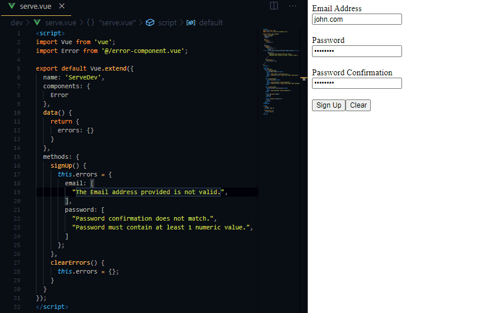

# Vue Error Component

An easy to use Laravel validation component for Vuejs.



# Install

To get started with `error-component`, you first need to install it:

```
npm i error-component --save
```

# Usage

## Import Component

To start using `error-component`, you need to import and register it:

```js
import { Error } from 'error-component';

export default Vue.extend({
  components: {
    Error
  },
  data() {
    return {
      form: {
        email: '',
        password: '',
      },
      errors: {},
    };
  },
  ...
```

## Set errors

To set errors, you'll need to catch them then populate the `errors` object:

```js
axios
  .post('/login', this.form)
  .then(() => {
    this.errors = {};
  })
  .catch((error) => {
    if (error?.response?.data?.errors !== undefined) {
      this.errors = error.response.data.errors;
    }
  });
```

Alternatively, you can use the `getErrors` helper method:

```js
import { Error, getErrors } from 'error-component';

...
axios
  .post('/login', this.form)
  .then(() => {
    this.errors = {};
  })
  .catch((error) => {
    this.errors = getErrors(error);
  });
```

And finally start using the tag:

```html
<error :errors="errors" name="email" />
```

# Help

Prop      | Type     | Description
----------|:---------|:-----------------------------
`errors`  | `Object` | Laravel validation response.
`name`    | `String` | The attribute name.
`limit`   | `Number` | The maximum errors to display

----


# Security

If you discover any security related issues, please email donaldpakkies@gmail.com instead of using the issue tracker.

# License

The MIT License (MIT). Please see [License File](LICENSE) for more information.
